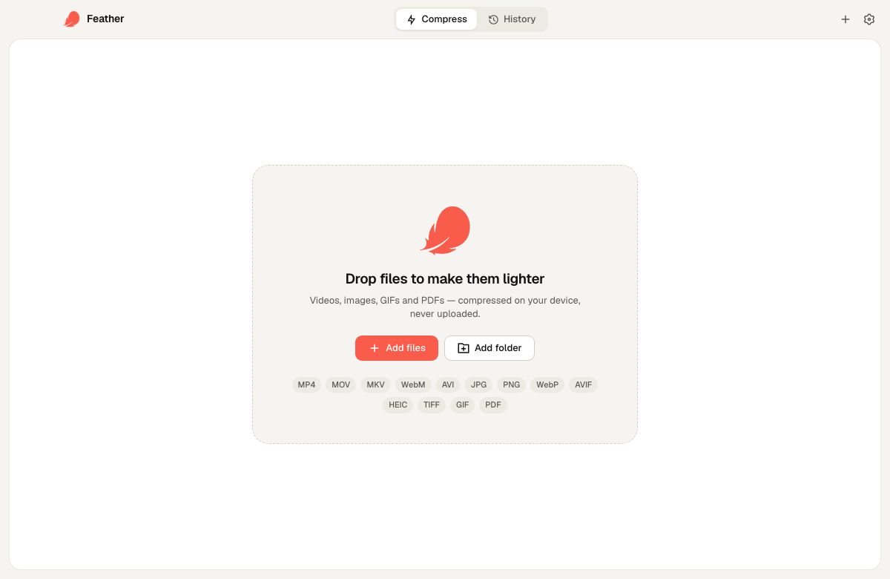
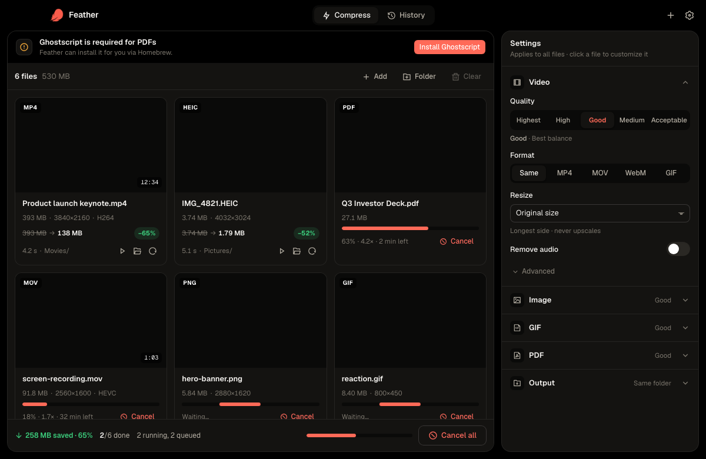

# Feather

**Make videos, images, GIFs and PDFs lighter — entirely on your device.**

Feather is a fast, open-source media compressor for macOS (Windows & Linux builds coming).
Drop files in, pick a quality, get smaller files. Nothing is uploaded, ever.

<p align="center">
  
</p>
<p align="center">
  <a href="https://github.com/FirasLatrech/feather/releases/latest">Download</a> ·
  <a href="https://github.com/FirasLatrech/feather/releases/download/v0.1.1/feather-trailer-16x9.mp4">Watch the trailer</a> ·
  <a href="#cli--mcp-ai-agents">CLI &amp; MCP</a>
</p>
<p align="center"><i>Video · Image · GIF · PDF — hardware-accelerated, batch, folder watching, CLI + MCP</i></p>

## Download

**Easiest — one line in Terminal** (downloads the latest release, installs to Applications, and grants it access to open):

```bash
curl -fsSL https://raw.githubusercontent.com/FirasLatrech/feather/main/install.sh | sh
```

Or grab the `.dmg` from the **[latest release →](https://github.com/FirasLatrech/feather/releases/latest)**.
Feather isn't notarized yet (it's open source, not signed by a paid Apple developer account), so if you install the
dmg by hand macOS says *"Feather is damaged"* — it isn't; run `xattr -cr /Applications/Feather.app` once and open it.

FFmpeg is downloaded by Feather itself on first launch if you don't have it. Ghostscript (PDF only) can be installed from Settings.

## Features

- **Video** — H.264 / H.265 / VP9 / AV1, hardware encoding (Apple VideoToolbox) always on, target file size, resize, frame rate, trim, remove audio, video → GIF, extract MP3. Bitrate-aware: never spends more bits than the source.
- **Images** — JPG (mozjpeg), PNG (oxipng), WebP, AVIF, HEIC/TIFF input, resize, keep metadata. Never produces a larger file.
- **GIF** — per-file palette + dithering, resize, fps.
- **PDF** — Ghostscript presets from print quality to screen.
- **Batch** with bounded parallelism, live speed × / ETA, size & time **estimates before you press Compress**.
- **Auto-compress**: watch folders (e.g. Downloads) and compress whatever lands there; optionally replace the original.
- Per-file setting overrides, output folder / naming templates, replace-in-place, move to Trash, keep dates.
- History with stats, notifications, light/dark theme.

## CLI & MCP (AI agents)

Feather ships `feather-cli` inside the app bundle (`Feather.app/Contents/MacOS/feather-cli`) — a command-line
tool **and** an [MCP](https://modelcontextprotocol.io) server, so Claude, Cursor or any MCP client can compress
files on your machine.

```bash
# Terminal
feather-cli compress ~/Movies/*.mp4 --quality good --max 1920
feather-cli compress photo.heic --format webp --out ~/Desktop
feather-cli probe video.mov · feather-cli estimate *.png --quality medium · feather-cli history

# Claude Code
claude mcp add feather -- /Applications/Feather.app/Contents/MacOS/feather-cli mcp

# Claude Desktop / Cursor (mcp.json)
{ "mcpServers": { "feather": { "command": "/Applications/Feather.app/Contents/MacOS/feather-cli", "args": ["mcp"] } } }
```

MCP tools: `compress` (paths, quality, format, max, out, replace, no_audio, codec, target_mb — with progress
notifications), `probe`, `estimate`, `history`. Destructive options (`replace`) are only applied when passed explicitly.
Settings → *AI agents · MCP* shows the exact commands with copy buttons.

## Requirements

- macOS 13+ (Apple Silicon or Intel)
- [FFmpeg](https://ffmpeg.org) — `brew install ffmpeg`
- [Ghostscript](https://www.ghostscript.com) for PDFs (optional) — `brew install ghostscript`

## Development

```bash
pnpm install
pnpm tauri dev          # desktop app
pnpm dev                # UI only, in the browser with a mocked backend (add ?demo=files)
cd src-tauri && FEATHER_SAMPLES=/path/to/samples cargo test   # engine tests against real ffmpeg/gs
```

Stack: [Tauri 2](https://tauri.app) (Rust) · React · TypeScript · Vite.
Engine: FFmpeg for video/GIF, Ghostscript for PDF, pure-Rust image codecs (`image`, `mozjpeg`, `oxipng`, `webp`, `ravif`).

## Screenshots

| Drop zone | Dark theme, batch running |
|---|---|
|  |  |

## Contributing

Issues and PRs are welcome. Run `pnpm tauri dev` for the app, `pnpm dev` for the UI in a browser (mock backend,
`?demo=files|running|done`), and `cargo test` in `src-tauri` (set `FEATHER_SAMPLES` to a folder with sample media
to run the encoder tests).

## Roadmap

See [PLAN.md](PLAN.md).

## License

MIT © Firas Latrach
